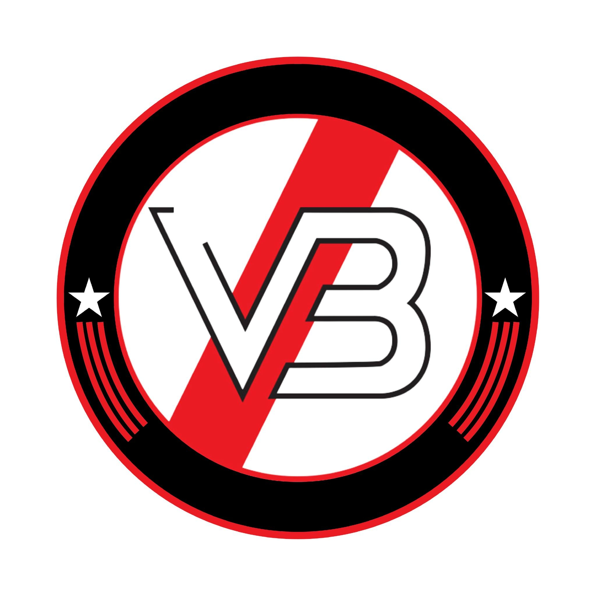

# VB Soccer - Club Deportivo Jesús María

Landing page moderna y responsive para el Club VB Soccer de Jesús María, Lima.



## 🎯 Descripción

Sitio web oficial del Club VB Soccer, un club deportivo comprometido con la formación integral en fútbol y futsal, representando a Jesús María con pasión, disciplina y valores.

## ✨ Características

- 🎨 **Diseño Moderno**: Tema oscuro elegante con acentos rojo y dorado
- 📱 **Responsive Design**: Optimizado para móvil, tablet y desktop
- 🖼️ **Galería Interactiva**: Lightbox funcional con navegación por teclado y touch
- ⚡ **Performance**: HTML5, CSS3 y JavaScript vanilla (sin frameworks pesados)
- 🎯 **SEO Optimizado**: Semántica HTML correcta y meta tags
- ♿ **Accesible**: Navegación por teclado y ARIA labels

## 📂 Estructura del Proyecto

```
vb_soccer_site/
├── index.html          # Página principal
├── css/
│   └── styles.css      # Estilos completos
├── js/
│   └── main.js         # JavaScript interactivo
└── assets/
    └── imgs/           # Imágenes del club
```

## 🚀 Uso

### Abrir localmente

Simplemente abre el archivo `index.html` en tu navegador web, o usa un servidor local:

```bash
# Usando Python
python -m http.server 8000

# Usando Node.js
npx serve

# Usando Live Server (VS Code)
# Click derecho en index.html > "Open with Live Server"
```

Luego visita: `http://localhost:8000`

### Deploy

Puedes deployar este sitio en cualquier servicio de hosting estático:

- **GitHub Pages**: Sube el proyecto a un repositorio y activa GitHub Pages
- **Netlify**: Arrastra la carpeta al dashboard de Netlify
- **Vercel**: Conecta tu repositorio Git
- **Surge**: `surge` desde la carpeta del proyecto

## 🏆 Secciones

1. **Hero**: Imagen destacada con CTAs principales
2. **Ramas Deportivas**: Fútbol Masculino, Fútbol Femenino, Futsal Femenino, Sub-12 CONMEBOL
3. **Logros**: Campeonatos y reconocimientos con fotos
4. **Galería**: Grid de imágenes con lightbox
5. **Sponsors**: Información de patrocinio
6. **Contacto**: WhatsApp, email, ubicación y redes sociales
7. **Footer**: Enlaces rápidos y copyright

## 📞 Contacto

- **WhatsApp**: [+51 988 880 449](https://wa.me/51988880449)
- **Email**: clubvbsoccer@gmail.com
- **Ubicación**: Campo de Marte, Jesús María, Lima, Perú

## 🔗 Redes Sociales

- Instagram Femenino: [@club_vbsoccer_femenino](https://www.instagram.com/club_vbsoccer_femenino)
- Instagram Masculino: [@club_vbsoccer](https://www.instagram.com/club_vbsoccer)
- Facebook: [ClubVB](https://www.facebook.com/ClubVB)
- TikTok: [@vb.soccer](https://www.tiktok.com/@vb.soccer)

## 🛠️ Tecnologías

- HTML5
- CSS3 (Vanilla CSS con variables CSS)
- JavaScript ES6+
- Google Fonts (Inter)

## 📝 Licencia

© 2026 VB Soccer. Todos los derechos reservados.

---

**"Integrando talentos, formando campeones"**
